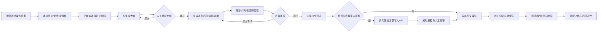

# 04 AI运营工作台 PRD（MVP评审稿）

## 1. 文档信息

| 项目 | 内容 |
|---|---|
| 产品名称 | AI运营工作台 |
| 首期模块 | AI培训课件 |
| 目标用户 | 总部/区域运营、店长、门店技师、培训讲师、审核人员 |
| 当前阶段 | PRD与架构评审，尚未进入开发 |
| 产品形态 | 统一Web端，供运营、门店和技师参与课件生产与审核；不包含学习端 |
| 建议结论 | 先完成课件生产—审核—发布—学习闭环，再扩展其他AI运营模块 |

## 2. 产品背景

全国门店培训资料来源分散、更新频繁，不同角色对内容深度和呈现方式要求不同。传统课件依赖人工整理资料、制作PPT、录音和剪辑，响应慢且版本难统一。

AI运营工作台不是通用聊天工具，而是嵌入运营与门店作业的任务平台。首期复用既有智能客服的模型网关、RAG、LangGraph、鉴权、评测与监控能力，新增培训知识域、课件工作流和第三方数字人视频合成能力。

## 3. 产品目标与非目标

### 3.1 MVP目标

1. 运营能基于已审核知识快速创建结构化课件。
2. 系统能生成大纲、逐页内容、讲稿、题目和PPT预览。
3. 经过人工审核后，可调用第三方数字人服务生成课件视频。
4. 店长和技师能按权限参与课件预览、业务校对和问题反馈。
5. 所有内容、知识来源、模型版本、审核和发布过程可追溯。
6. 验证课件制作周期、审核返工率、学习完成率等业务价值。

### 3.2 MVP非目标

- 不同时开发图像质检、检测报价和养护方案完整功能，仅保留入口占位。
- 不训练新的基础大模型；首期采用Prompt、模板与RAG。
- 不自研TTS、数字人口型和视频渲染模型。
- 不允许AI生成内容未经审核直接发布。
- 不建设轻量学习端，不替换现有LMS或作业系统。
- 不支持直播数字人和实时互动数字人。
- 不承诺未经基线验证的效率提升比例。

## 4. 用户与权限

| 角色 | 主要权限 | 数据范围 |
|---|---|---|
| 平台管理员 | 租户、角色、供应商、模板、全局配置 | 全局 |
| 培训/总部运营 | 创建课件、编辑、提交审核、发布、查看分析 | 所授权业务线/区域 |
| 区域运营 | 创建区域课件、审核或协审、查看区域学习数据 | 所辖区域 |
| 内容/业务审核员 | 审核事实、安全、品牌和发布版本 | 指定课程/业务线 |
| 店长 | 分配学习、查看本店进度、提交反馈 | 本店 |
| 技师 | 预览试点课件、校对专业内容、反馈错误 | 被授权课程 |

采用RBAC加数据域权限；`tenant_id`、`org_id`、`store_id`、`biz_line`必须贯穿接口、数据库、检索和审计。

## 5. 核心业务流程

## 6. 信息架构

### 6.1 一级导航

| 导航 | MVP功能 | 可见角色 |
|---|---|---|
| 工作台 | 待办、生成状态、审核提醒、核心指标 | 全角色，内容因角色不同 |
| AI培训课件 | 课程列表、创建、编辑、审核、HTML预览与发布 | 全角色，操作权限不同 |
| AI图像质检 | 二期占位与权限隐藏 | 后续 |
| AI检测报价 | 二期占位与权限隐藏 | 后续 |
| AI养护方案 | 二期占位与权限隐藏 | 后续 |
| 知识与素材 | 知识引用、素材选择；治理后台可跳转 | 运营/审核/管理员 |
| 数据分析 | 生产效率、发布、学习和反馈 | 运营/店长 |
| 系统管理 | 模板、角色、供应商、字典和审计 | 管理员 |

### 6.2 核心页面

1. 登录与组织上下文选择。
2. 角色工作台。
3. 课程列表与筛选。
4. 创建课程向导。
5. AI大纲编辑器。
6. 逐页课件编辑器：页面、讲稿、引用、素材和题目。
7. 审核中心：差异、引用、风险项和审核意见。
8. 数字人视频生成中心：形象、音色、任务和失败重试。
9. 发布与分配页面。
10. 课件发布记录和问题反馈页面。

## 7. 功能需求

### 7.1 工作台

- 根据角色展示“我创建的、待我审核、待我学习、生成中、失败、已发布”。
- 运营展示课件生产数量、平均周期、审核退回和使用数据。
- 店长展示本店学习完成率、逾期人员和测验情况。
- 技师展示必修、选修、最近学习和待完成测验。

### 7.2 课程创建

必填字段：课程名称、业务线、课程类型、受众、目标、预计时长、适用组织、知识来源、课件模板、有效期。

支持三种输入：

- 从已发布知识库选择资料；
- 上传待审核文档；
- 基于已有课程复制新版本。

上传资料在完成解析、病毒检测、权限校验和知识审核前，不得用于正式发布。

### 7.3 AI大纲与内容生成

- 大纲采用结构化JSON生成，包含章节、目标、时长、要点、案例和题目规划。
- 运营可增删、排序、锁定章节后再生成正文。
- 逐页生成标题、正文、讲稿、素材建议、互动题和知识引用。
- 支持单页重生成，不强制整课重算。
- 生成结果标记模型、Prompt、工作流和知识版本。
- 证据不足时显示“需要补充资料”，不得编造。

### 7.4 课件编辑与预览

- 支持PPT式页面结构和16:9预览。
- 文字、图片、数字人位置使用模板槽位，不做首期自由画布编辑器。
- 图片优先来自公司已授权素材库；AI图片仅用于非技术性装饰图。
- 技术操作、安全规范、商品规格必须使用审核后的真实图片或标准图。
- 可导出PPTX/PDF的能力列为MVP增强项，开发前确认模板技术可行性。

### 7.5 审核

审核分为：内容事实、安全/合规、品牌呈现、发布终审。MVP可由同一审核角色依次完成，但每次操作留痕。

- 显示引用原文及版本。
- 标记无引用、知识冲突、过期资料、高风险表述和敏感信息。
- 支持逐页批注、批准、退回和原因码。
- 大纲确认和最终发布为强制人工节点。
- 安全维修错误、错价、侵权素材或未授权肖像为发布阻断项。

### 7.6 数字人视频生成

- 只对审核通过的讲稿开放生成。
- 用户选择已授权的供应商形象和音色，不能任意上传他人肖像/声音。
- 通过统一供应商适配接口提交异步任务。
- 展示排队、生成中、成功、失败、取消和已过期状态。
- 支持回调、幂等、超时、有限重试和失败原因。
- 供应商结果下载至公司对象存储；外部临时URL不得作为长期播放地址。
- 若供应商返回透明数字人视频，则内部合成；若供应商支持PPT整片模式，可直接接收成片。两种模式由适配器屏蔽差异。

### 7.7 发布与反馈

- 发布对象可按业务线、区域、门店、岗位和人员选择。
- 支持生效时间、失效时间、必修/选修、完成期限。
- 首期发布指将审核版本固化并生成可供现有LMS/门店系统消费的版本记录，不承担学习播放。
- 店长与技师可在工作台预览授权课件并提交专业校对意见。
- 反馈可关联具体课程版本、页面和播放时间点。

### 7.8 版本与审计

- 草稿、审核中、退回、待生成、生成中、待发布、已发布、已下线、已归档。
- 已发布课程只能创建新版本修改，不能覆盖历史版本。
- 保存知识、Prompt、模型、数字人供应商、形象、音色和成片版本。
- 审计日志不可由普通用户删除。

## 8. 关键业务规则

1. AI不能自行发布课件。
2. 课件引用过期或被撤回时触发重新审核，不自动静默更新。
3. 数字人供应商只收到已审核的最小必要数据。
4. 同一课件版本重复提交数字人任务必须使用幂等键，避免重复扣费。
5. 供应商失败时允许发布图文/PPT版本，不阻断培训业务。
6. 所有涉及维修安全、价格、服务承诺的内容以权威知识和业务系统为准。
7. 形象、声音、图片和视频素材必须具备企业商用授权。

## 9. 非功能需求

| 类别 | MVP要求 |
|---|---|
| 可用性 | AI或数字人不可用时，编辑、审核、学习及既有课程仍可用 |
| 性能 | 普通页面P95待压测后冻结；生成任务全部异步，不占用同步请求 |
| 安全 | SSO/OIDC预留、RBAC、数据域隔离、HTTPS、密钥托管、敏感信息脱敏 |
| 审计 | 关键操作、模型调用、知识引用、供应商提交和发布全留痕 |
| 可观测 | trace_id贯穿Web、Agent、模型、RAG、供应商和回调 |
| 成本 | 记录每任务token、数字人分钟数、重试次数和预估/实际费用 |
| 可替换 | 大模型、Embedding和数字人供应商均通过适配接口解耦 |
| 数据留存 | 原始资料、成片和日志期限由数据治理评审确认 |

## 10. 指标与验收

### 10.1 产品指标

- 课件从创建到审核通过的中位时长。
- 单课件人工编辑/审核工时。
- 大纲一次通过率、页面退回率、成片返工率。
- 课程发布数、学习完成率、测验通过率和问题反馈率。
- 数字人任务成功率、平均生成时长、单位视频分钟成本。

### 10.2 MVP功能验收

- 三类核心用户可按权限完成各自任务。
- 运营可完成“资料—大纲—内容—审核—数字人—发布”闭环。
- 店长和技师可按权限预览课件并提交校对反馈。
- AI输出可查看引用和版本；无证据内容可被阻断。
- 数字人供应商可使用Mock适配器完整演示，真实供应商选定后可替换接入。
- 发布版本可下线、回滚，历史学习记录不丢失。
- 越权、重复回调、重复扣费、供应商超时和敏感素材用例通过。

## 11. MVP优先级

### P0

- 用户/角色/组织数据模型和Mock登录。
- 课程创建、AI大纲、逐页内容、引用、审核。
- 模板化预览、数字人Mock适配器、任务中心。
- 发布记录、HTML预览和校对反馈。
- 审计、基础指标和错误处理。

### P1

- 接入一家真实数字人供应商。
- PPTX/PDF导出或供应商PPT整片生成。
- LMS/门店系统真实SSO及发布接口。
- 运营分析、成本看板和消息通知。

### P2

- 多供应商路由、自动成本优化、多语言。
- 智能推荐课程和个性化学习路径。
- 接入图像质检、检测报价和养护方案模块。

## 12. 待产品评审项

1. 首期真实用户入口是独立Web、蓝虎/门店系统还是技师作业系统嵌入。
2. 已确认不建设学习端，现有LMS继续承担学习与学习数据。
3. 首批课程业务线、课程类型和试点门店。
4. 审核链是总部单审还是业务、安全、品牌多级审。
5. 数字人首选腾讯、阿里、百度或现有内部供应商。
6. 已确认首期采用HTML课件预览，PPTX不作为P0。
7. 员工、组织、门店、岗位数据的权威系统和接口owner。

## 13. 建议试点

选择一个资料完备、风险较低、制作频率较高的门店标准服务课程；运营人员5—10名、店长/技师若干，先完成10门以内课程的影子生产和内部学习。以现行人工制作流程作为对照，达到质量护栏后再扩大业务线与门店。
