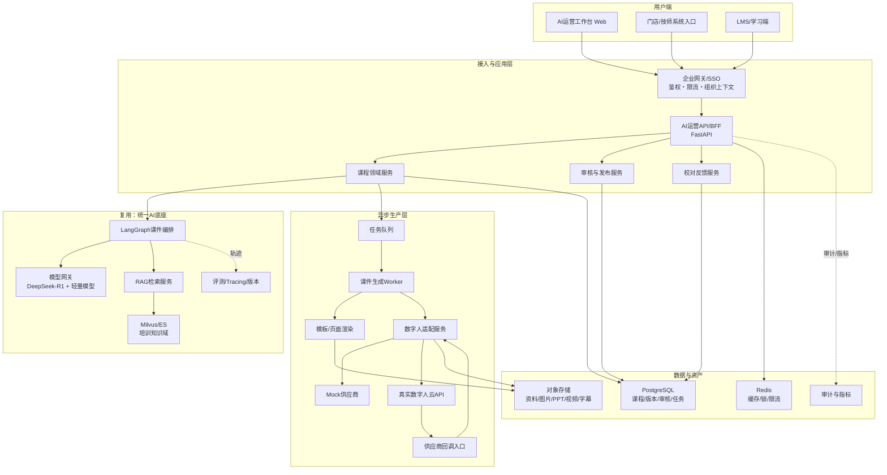
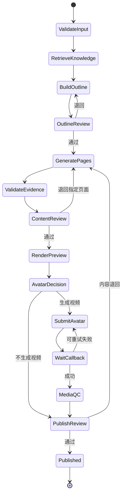
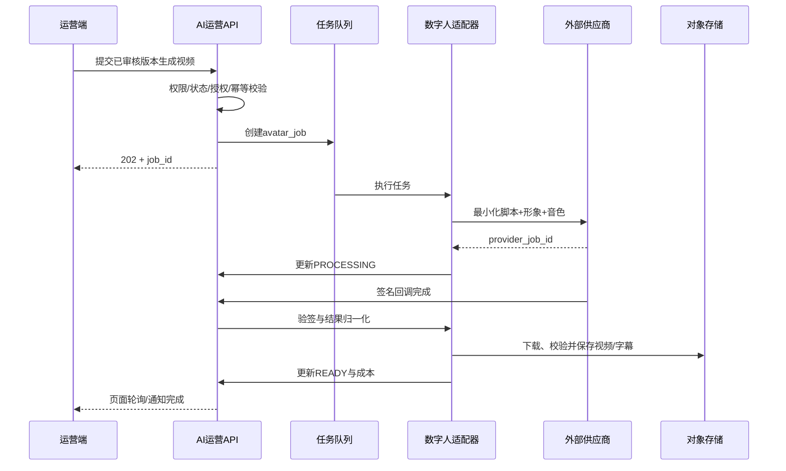

# 05 AI运营工作台架构设计（MVP评审稿）

## 1. 架构目标

建设面向运营、店长和技师的统一AI运营工作台，首期交付AI培训课件闭环，同时保持四个运营场景可扩展。架构必须复用智能客服底座、隔离在线客服与离线媒体负载、允许替换数字人供应商，并支持本地Mock演示后平滑切换真实企业接口。

## 2. 复用与新增边界

### 2.1 复用智能客服底座

- DeepSeek-R1/其他指令模型的统一模型网关。
- FastAPI服务化范式与OpenAI兼容调用。
- LangGraph状态机、Checkpoint、结构化输出和工具白名单。
- Milvus＋ES混合检索、Embedding和知识治理能力。
- 身份、租户、权限、限流、审计、Tracing、评测、灰度和回滚范式。
- Java业务系统接口契约、幂等、重试和发布规范。

### 2.2 新增能力

- AI运营Web端及后端BFF/API。
- 课程、页面、审核、版本、发布、学习、测验和反馈领域。
- 培训知识域与课件生成工作流。
- PPT/HTML模板渲染与素材管理。
- 数字人供应商抽象、异步任务、回调、计费和资产下载。
- 门店/技师组织权限与LMS/作业系统集成。

### 2.3 明确隔离

- 在线客服推理与离线视频任务不共用执行队列。
- 数字人供应商不直接访问模型、RAG或业务数据库。
- 客服知识域与培训知识域逻辑隔离。
- 课件长任务不得占用客服同步API线程或客服GPU服务配额。

## 3. 总体架构



## 4. 推荐技术栈

| 层 | MVP建议 | 说明 |
|---|---|---|
| 前端 | React + TypeScript + Vite | 单体Web，组件化保留模块扩展能力 |
| API/BFF | Python FastAPI + Pydantic | 与既有AI服务一致，适合SSE/异步任务API |
| Agent | LangGraph | 明确人工节点、Checkpoint、重试和状态恢复 |
| ORM/迁移 | SQLAlchemy 2 + Alembic | 关系数据、版本和审计易治理 |
| 主库 | PostgreSQL | 课程、审核、任务、发布和学习记录 |
| 缓存/锁 | Redis | 缓存、限流、分布式锁；不作为权威任务库 |
| 任务队列 | 首版可用Redis队列/Celery；生产评审后确定 | 数字人和课件生成必须异步 |
| 对象存储 | S3兼容；本地Demo使用文件适配器 | 原始资料、素材、PPT、视频、字幕 |
| RAG | 复用Milvus + ES + Embedding | 使用独立培训collection/index和ACL |
| 模型 | 复用模型网关 | R1处理复杂规划/审核，轻量模型处理抽取/格式化 |
| 视频 | 外部数字人API | 首版Mock，P1接一家真实供应商 |
| 可观测 | OpenTelemetry语义预留＋结构化日志 | `trace_id`贯穿全链路 |

MVP若需快速本地演示，可使用SQLite、内存队列和本地文件；代码必须通过Repository/Adapter接口与生产实现解耦。

## 5. 领域模块

```text
ai-ops
├── identity        用户、组织、门店、角色、数据域
├── course          课程、章节、页面、讲稿、版本
├── knowledge       培训知识引用与素材选择
├── generation      大纲、正文、题目、课件工作流
├── review          审核、批注、规则阻断
├── media           模板、PPT、数字人任务、视频资产
├── publication     发布、下线、分配、有效期
├── feedback        门店/技师专业校对反馈
├── analytics       效率、质量、使用和成本指标
└── administration  模板、供应商、字典、审计
```

首期建议模块化单体，不拆大量微服务；模型/RAG、对象存储和数字人供应商属于外部边界。业务规模、团队边界或独立扩缩需求明确后再拆服务。

## 6. LangGraph课件工作流



人工审核不是LLM节点模拟，而是持久化暂停：Graph保存checkpoint，审核API写入决定后再恢复。数字人等待也不得占用进程线程，由任务状态和回调驱动。

## 7. 模型使用策略

| 任务 | 建议能力 | 原因 |
|---|---|---|
| 文档分类/元数据抽取 | 轻量模型或规则 | 成本低、结构稳定 |
| 大纲与复杂案例 | DeepSeek-R1或评测胜出的主模型 | 需要跨资料规划与推理 |
| 逐页文本/讲稿 | 主模型，按模板结构化输出 | 内容质量与格式并重 |
| 题目生成 | 主模型＋规则/答案校验 | 防止错误答案 |
| 证据检查 | 确定性校验＋轻量模型 | 不能依赖模型自评 |
| 最终内容审核辅助 | R1＋规则，但不代替人工 | 高风险业务需要人工签字 |

首期不微调。只有真实生产数据证明Prompt/RAG无法稳定达到门槛，且具备高质量训练集后，才评审LoRA；LoRA可以通过现有vLLM基座按请求加载，无需复制完整大模型。

## 8. 数字人供应商适配设计

### 8.1 内部统一接口

```text
AvatarProvider
├── list_avatars()
├── list_voices()
├── submit_video(request, idempotency_key)
├── get_job(provider_job_id)
├── cancel_job(provider_job_id)
├── verify_callback(headers, body)
└── normalize_result(provider_response)
```

统一请求建议字段：

```json
{
  "course_version_id": "cv_xxx",
  "avatar_id": "internal_avatar_xxx",
  "voice_id": "internal_voice_xxx",
  "script": "已审核的最终讲稿",
  "mode": "transparent_avatar",
  "resolution": "1920x1080",
  "subtitle": true,
  "callback_url": "https://example/api/v1/avatar/callback/provider"
}
```

内部ID映射供应商ID，前端不暴露供应商密钥或真实接口细节。

### 8.2 两种渲染模式

1. `transparent_avatar`：供应商返回透明/绿幕数字人及字幕，内部模板服务叠加PPT。控制力强，供应商可替换。
2. `ppt_full_video`：供应商接收PPT和讲稿并返回完整成片。开发少，但模板兼容和厂商锁定更强。

适配器必须同时表达两种能力，具体供应商通过capability声明。

### 8.3 状态机

```text
DRAFT → SUBMITTED → QUEUED → PROCESSING
                         ├→ SUCCEEDED → DOWNLOADING → READY
                         ├→ RETRYABLE_FAILED → SUBMITTED
                         ├→ PERMANENT_FAILED
                         └→ CANCELLED
```

数据库保存内部任务和每次供应商attempt。重试产生新attempt但复用业务幂等键；是否重复计费必须从供应商回执/账单核对。

### 8.4 安全要求

- 凭据放入密钥管理/环境注入，不入库、不进前端、不写日志。
- 回调必须校验签名、时间戳、重放窗口和来源策略。
- 仅传审核后的讲稿和已授权素材，移除内部知识引用、用户信息和提示词。
- 供应商URL下载后执行类型、大小、病毒/恶意文件检查，再进入对象存储。
- 下载URL使用短时签名；公开视频与原始素材分bucket/前缀授权。
- 记录供应商删除期限、数据是否训练、形象/声音授权和合同版本。

## 9. 核心数据模型

| 表/聚合 | 关键字段 |
|---|---|
| `users` | id, external_id, name, status |
| `organizations` | id, parent_id, type, region_code |
| `user_roles` | user_id, role, data_scope |
| `courses` | id, tenant_id, biz_line, title, owner_id, status |
| `course_versions` | id, course_id, version, audience, objective, effective_at, knowledge_snapshot_id |
| `course_sections` | id, version_id, order_no, title, objective |
| `course_pages` | id, section_id, order_no, layout_id, content_json, narration, evidence_status |
| `knowledge_citations` | page_id, source_id, source_version, chunk_id, quote_hash |
| `review_tasks` | id, version_id, stage, assignee_id, status, decision, reason_code |
| `review_comments` | review_id, page_id, author_id, content, resolved_at |
| `media_assets` | id, owner_type, storage_key, mime_type, sha256, license_id, status |
| `avatar_jobs` | id, version_id, provider, mode, idempotency_key, status, cost_estimate |
| `avatar_attempts` | id, job_id, provider_job_id, request_hash, status, error_code, billed_amount |
| `publications` | id, version_id, target_scope, start_at, end_at, status |
| `learning_assignments` | id, publication_id, assignee_type, assignee_id, deadline |
| `learning_progress` | user_id, publication_id, progress, last_position, completed_at |
| `quizzes/attempts` | 题目、审核版本、作答、得分 |
| `feedback` | user_id, version_id, page_id, media_time, category, content |
| `audit_events` | actor, action, resource, before_hash, after_hash, trace_id, occurred_at |

生成内容使用JSON字段保留模板灵活性，但状态、权限、版本、成本和审计字段必须结构化。

## 10. API边界（草案）

### 课程与生成

```text
POST   /api/v1/courses
GET    /api/v1/courses
GET    /api/v1/courses/{id}
POST   /api/v1/courses/{id}/versions
POST   /api/v1/course-versions/{id}/outline:generate
PATCH  /api/v1/course-versions/{id}/outline
POST   /api/v1/course-versions/{id}/pages:generate
POST   /api/v1/course-pages/{id}:regenerate
GET    /api/v1/generation-jobs/{id}
```

### 审核与发布

```text
POST   /api/v1/course-versions/{id}/reviews
GET    /api/v1/reviews/inbox
POST   /api/v1/reviews/{id}:approve
POST   /api/v1/reviews/{id}:reject
POST   /api/v1/course-versions/{id}/publications
POST   /api/v1/publications/{id}:offline
```

### 数字人

```text
GET    /api/v1/avatar/capabilities
GET    /api/v1/avatar/avatars
GET    /api/v1/avatar/voices
POST   /api/v1/course-versions/{id}/avatar-jobs
GET    /api/v1/avatar-jobs/{id}
POST   /api/v1/avatar-jobs/{id}:cancel
POST   /api/v1/avatar/callback/{provider}
```

### 校对反馈

```text
GET    /api/v1/course-versions/{id}/preview
POST   /api/v1/course-versions/{id}/feedback
GET    /api/v1/course-versions/{id}/feedback
```

所有变更接口接受`X-Request-Id`；涉及费用或发布的接口还要求幂等键和细粒度权限。

## 11. 关键序列

### 11.1 数字人生成



## 12. 部署拓扑

### 本地演示

```text
Web + FastAPI + SQLite/PostgreSQL
内存/Redis任务队列
Mock LLM或现有模型接口
轻量本地检索/现有RAG
本地对象存储目录
Mock数字人适配器（生成占位结果）
```

### 生产建议

```text
WAF/企业网关
  ├── Web静态资源/CDN
  └── AI运营API副本
        ├── PostgreSQL HA
        ├── Redis
        ├── 任务队列与Worker池
        ├── 公司对象存储
        ├── 现有模型网关/RAG
        └── 数字人供应商公网出口/NAT
```

供应商访问通过固定出口、域名白名单和超时/熔断；回调经独立限流入口，不允许访问内网其他服务。

## 13. 可观测与成本

每次生成保存：

- `trace_id/course_version_id/job_id/provider_job_id`；
- 模型、Prompt、知识快照和token；
- 各节点耗时、重试和错误；
- 视频请求秒数、成功秒数、分辨率、供应商报价规则；
- 估算费用、供应商回执费用和月度账单对账状态。

核心告警：任务积压、回调验签失败、供应商错误率、重复任务、费用异常、知识过期、发布失败和越权访问。

## 14. 测试策略

| 层次 | 重点 |
|---|---|
| 单元 | 状态机、权限、幂等、费用、供应商结果归一化 |
| 契约 | 模型/RAG/对象存储/数字人/LMS接口stub与schema |
| 工作流 | 人工暂停恢复、局部重生成、回调、失败重试、下线 |
| AI评测 | 大纲、事实引用、术语、安全、题目答案和无证据拒绝 |
| 安全 | 越权、回调伪造、重放、恶意文件、提示注入、PII外发 |
| 性能 | 页面/API、并发生成、队列积压、供应商限流和回调洪峰 |
| 业务验收 | 运营制作、审核、店长分配、技师学习的端到端流程 |

## 15. 开发分期

### Sprint 0：工程骨架

- 前后端、数据库迁移、身份/角色Mock、CI和基础测试。
- 模型、RAG、对象存储、数字人四类Adapter接口。

### Sprint 1：内容生产

- 课程、大纲、页面、知识引用和生成任务。
- 课件模板预览和局部编辑。

### Sprint 2：审核与媒体

- 审核状态机、批注、发布阻断。
- Mock数字人任务、回调、资产和成本记录。

### Sprint 3：学习闭环

- 发布记录、HTML预览、门店/技师校对反馈和工作台。
- 端到端测试、演示数据和指标。

### P1：真实集成

- 接一家真实数字人供应商。
- 对接企业SSO、组织/门店、LMS或技师系统。
- 单门店/小流量灰度。

## 16. 编码前必须冻结的决策

1. 前端框架和是否需要与现有门店系统统一UI技术栈。
2. 已确认默认调用现有智能客服模型与RAG接口，未配置时使用Mock保证CI可验收。
3. 已确认首期先做HTML课件预览，不要求生成PPTX。
4. 真实数字人供应商先不绑定，还是在P1提前选腾讯/阿里/百度。
5. 已确认MVP不带学习端，后续只对接现有LMS。
6. 已确认演示课程为“轮胎基础知识与标准服务流程”。

建议默认：独立React Web、FastAPI模块化单体、PostgreSQL、Mock企业接口、复用现有模型/RAG边界、Mock数字人、内置轻量学习端。完成可演示闭环后，再以Adapter替换真实系统。
