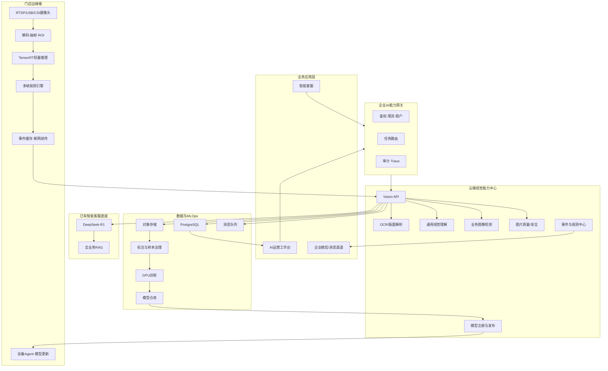
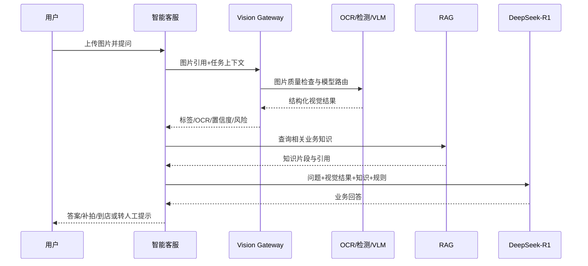

# AI视觉能力与门店巡检架构设计（V0.1）

## 1. 架构目标

- 在现有DeepSeek-R1和RAG底座旁新增独立视觉服务域。
- 同一视觉底座同时服务智能客服和门店巡检。
- 门店视频优先在边缘处理，云端负责管理、训练和业务闭环。
- 模型和硬件可替换，业务系统不绑定具体厂商API。
- 支持弱网、离线、灰度发布、版本回滚和全链路审计。

## 2. 总体架构



## 3. 关键架构决策

### ADR-01：视觉模型与DeepSeek-R1解耦

DeepSeek-R1不直接承担图像编码。视觉服务先将图片转换为结构化结果，R1再结合用户问题和RAG知识进行推理。这样可独立替换VLM、OCR和检测模型，也不会影响已有文本客服。

### ADR-02：门店视频采用边缘推理

全天视频不上传云端。边缘端完成解码、抽帧、检测和多帧判断，只上传事件元数据、截图和短视频。由此降低带宽、云端GPU费用和隐私风险。

### ADR-03：不同任务使用组合模型

- 目标检测模型负责人员、工服、Logo、灭火器和通道物体。
- 分类模型负责工服状态、门头状态和图片质量。
- OCR负责胎侧文字、订单和报告字段。
- VLM负责开放式图片理解和低频复杂复核。
- 规则引擎将单帧结果转化为事件。

### ADR-04：统一API，不让业务绑定模型

业务系统传递`biz_scene`、`task`和图片引用，由视觉网关选择模型。模型替换、量化和厂商切换不改变业务接口。

## 4. 组件设计

### 4.1 Vision Gateway

职责：

- 统一鉴权、限流、幂等和审计。
- 根据场景选择OCR、检测、VLM或组合流水线。
- 管理同步/异步任务、超时和降级。
- 返回统一结构化结果。

建议接口：

```text
POST /v1/vision/analyze
POST /v1/vision/events
POST /v1/vision/events/{id}/verify
GET  /v1/vision/tasks/{id}
GET  /v1/models/manifest
POST /v1/edge/heartbeat
POST /v1/edge/events/batch
```

### 4.2 客服视觉编排



### 4.3 边缘视频流水线

推荐采用GStreamer/DeepStream完成视频接入和硬件解码，TensorRT执行推理。DeepStream可处理RTSP、USB、CSI等视频源并在Jetson和云端GPU上运行。

流水线：

```text
RTSP接入
→ 硬件解码
→ 帧率采样
→ ROI裁剪
→ 批量推理
→ 跟踪/多帧聚合
→ 规则引擎
→ 证据裁剪
→ 本地队列
→ 云端补传
```

### 4.4 边缘Agent

- 设备注册和证书轮换。
- 摄像头配置同步。
- 心跳、资源和进程状态上报。
- 模型下载、校验、激活和回滚。
- 本地事件队列和磁盘水位管理。
- 远程日志采样，不允许默认远程获取完整视频。

## 5. 模型架构

### 5.1 推荐模型体系

| 任务 | 候选模型 | 部署位置 |
|---|---|---|
| 门店通用目标检测 | RTMDet/PicoDet/轻量RT-DETR | 边缘端 |
| 工服属性分类 | MobileNetV3/EfficientNet-Lite | 边缘端 |
| 通道占用 | 检测＋ROI规则，必要时轻量分割 | 边缘端 |
| 胎侧OCR | 文本检测＋识别 | 云端 |
| 文档OCR/版面 | OCR＋版面解析 | 云端 |
| 开放式图片理解 | 通用VLM | 云端 |
| 疑难事件复核 | VLM＋业务规则 | 云端异步 |

训练框架优先使用Apache 2.0许可的PaddleDetection或MMDetection，避免业务代码被不合适的开源许可绑定。

### 5.2 轻量化流程

```text
PyTorch/Paddle训练权重
→ 导出ONNX
→ ONNX一致性验证
→ TensorRT FP16基线
→ INT8校准与精度验证
→ 目标硬件基准测试
→ 模型签名
→ 灰度设备
→ 事件级指标评估
→ 全量发布
```

TensorRT Engine必须按目标JetPack/TensorRT/硬件组合构建和管理，不能假定跨版本兼容。

## 6. 数据架构

### 6.1 PostgreSQL

保存：

- 门店、设备、摄像头和ROI。
- 规则、规则版本和例外。
- 事件、核查、整改和复验。
- 模型元数据、发布批次和设备版本。
- 客服视觉请求元数据和审计记录。

### 6.2 对象存储

保存：

- 原始上传图片。
- 脱敏图片。
- 异常截图、标注图和短视频。
- 数据集版本和模型文件。

对象存储使用私有Bucket和短期签名URL。业务数据库只保存对象引用、哈希、权限和保留期限。

### 6.3 消息队列

用于：

- 异步视觉任务。
- 事件通知。
- 证据处理。
- 样本回流。
- 模型发布任务。

安全事件与离线训练任务使用不同队列，避免训练或批量任务阻塞告警。

## 7. API契约示例

### 7.1 图片分析

```json
{
  "biz_scene": "customer_service",
  "task": "tire_damage_analysis",
  "image_urls": ["oss://private/image.jpg"],
  "context": {
    "conversation_id": "C001",
    "question": "这个轮胎还能继续使用吗"
  }
}
```

响应：

```json
{
  "request_id": "VIS001",
  "status": "completed",
  "model_versions": ["tire-detector-1.0.0", "ocr-2.1.0"],
  "result": {
    "image_type": "tire_sidewall",
    "texts": ["225/55 R17", "97W"],
    "detections": [
      {"label": "suspected_sidewall_bulge", "confidence": 0.86}
    ]
  },
  "decision": "manual_confirmation_required"
}
```

### 7.2 边缘事件

```json
{
  "event_key": "EDGE01-CAM03-RULE08-20260811133000",
  "store_id": "SH001",
  "device_id": "EDGE01",
  "camera_id": "CAM03",
  "rule_id": "RULE08",
  "event_type": "emergency_exit_blocked",
  "started_at": "2026-08-11T13:30:00+08:00",
  "duration_seconds": 35,
  "confidence": 0.91,
  "model_version": "store-detector-1.0.0",
  "evidence": ["oss://private/event.jpg"]
}
```

## 8. 边缘硬件

### 8.1 POC

- Jetson Orin Nano Super 8GB。
- NVMe SSD 256GB或以上。
- 2至4路1080p摄像头，按场景抽帧而非全帧推理。
- 有线网络优先，配合小型UPS。

官方资料显示Orin Nano Super最高67 INT8 TOPS、功耗7W至25W。开发套件用于POC，正式铺设选择工业整机或生产模块。

### 8.2 规模试点

- 4至8路视频或多模型并行时评估Orin NX 8GB/16GB。
- 工业整机需具备看门狗、宽温、稳定电源、远程恢复和供货周期保证。
- 模型稳定后再评估RK3588/国产NPU降本路线。

## 9. 高可用与降级

- 边缘断网：继续识别，本地队列按优先级保留事件。
- 摄像头断流：指数退避重连并上报设备异常。
- 模型加载失败：恢复上一稳定模型。
- VLM超时：返回OCR/检测结果并转人工，不阻塞客服会话。
- 云端事件服务不可用：边缘批量补传，依赖幂等键去重。
- 对象存储不可用：先保存本地证据，元数据标记待上传。

## 10. 安全设计

- 设备使用独立证书，不使用共享静态Token。
- 模型包使用哈希和签名校验。
- 边缘设备只建立出站连接，不开放公网管理端口。
- 图片上传执行格式校验、病毒检查和元数据清理。
- 用户图片、员工图片和训练数据分域授权。
- 不做人脸识别；人物检测结果只保留业务所需属性。
- 原始证据默认30天生命周期，超期自动删除。

## 11. 可观测性

统一`trace_id`贯穿：

```text
客服会话/边缘事件
→ Vision Gateway
→ OCR/检测/VLM
→ RAG
→ DeepSeek-R1
→ 通知/整改
```

关键指标：

- 模型调用量、延迟、错误率和GPU/NPU利用率。
- 摄像头在线率、视频重连次数、推理帧率。
- 事件准确率、召回率、单店日均无效告警。
- 模型版本分布、灰度成功率和回滚次数。
- 证据上传积压和边缘磁盘水位。

## 12. 部署拓扑

### POC

```text
云端Linux
├── Vision Gateway
├── OCR/VLM/检测服务
├── 事件与整改API
├── PostgreSQL
├── Redis/消息队列
├── 对象存储适配器
└── 模型注册服务

5家试点门店
└── 每店1台Jetson
    ├── DeepStream/GStreamer
    ├── TensorRT模型
    ├── 规则引擎
    ├── 本地缓存
    └── 设备Agent
```

### 规模化

- 云端服务无状态横向扩容。
- PostgreSQL高可用、对象存储使用公司统一服务。
- 训练集群与在线推理解耦。
- 边缘设备分区域、分批次灰度。

## 13. 技术验证清单

1. 现有摄像头RTSP兼容性和实际码流测试。
2. Jetson上2/4/8路视频基准测试。
3. FP16与INT8的事件级精度差异。
4. 断网24小时后的事件补传和磁盘控制。
5. 摄像头夜间、逆光、遮挡和角度变化测试。
6. 客服图片OCR、VLM和RAG组合效果评测。
7. 模型灰度、失败回滚和签名验证。
8. 企业微信告警限流和聚合策略。

## 14. 技术选型结论

- 现有DeepSeek-R1与RAG继续复用。
- 新增独立Vision Gateway和视觉模型服务，不重新训练R1。
- 边缘首期采用Jetson＋DeepStream/GStreamer＋TensorRT。
- 训练优先采用PaddleDetection/MMDetection体系。
- PostgreSQL保存权威业务数据，Redis/消息队列只承担缓存和异步任务。
- 图片和短视频进入私有对象存储，不存入数据库大字段。
- 通过统一API、Adapter和模型注册中心保持供应商与硬件可替换。

## 15. 参考资料

- NVIDIA Jetson Orin Nano文档：https://docs.nvidia.com/jetson/orin-nano-devkit/user-guide/index.html
- NVIDIA Jetson产品与价格FAQ：https://developer.nvidia.com/embedded/faq
- NVIDIA DeepStream概览：https://docs.nvidia.com/metropolis/deepstream/dev-guide/text/DS_Overview.html
- PaddleDetection：https://github.com/PaddlePaddle/PaddleDetection
- MMDetection：https://github.com/open-mmlab/mmdetection
