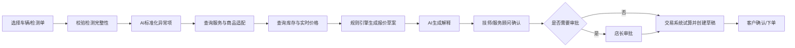

# AI检测报价产品PRD（V0.1）

## 1. 产品概述

AI检测报价模块根据车辆与检测数据生成可解释的报价草案，帮助技师和服务顾问快速完成异常确认、商品选择、价格试算和客户沟通。最终报价必须经人工确认，并由交易系统生成权威金额。

## 2. 产品原则

- 事实来自检测和业务系统，AI不得补造缺失事实。
- 价格、库存、促销、会员权益和税费全部实时查询。
- 大模型生成解释，不执行金额计算。
- 高安全风险、低置信度和信息缺失必须转人工。
- 每次报价保留完整证据、版本和人工修改记录。

## 3. 用户故事

### 技师

- 我希望检测数据自动进入报价工作台，避免重复录入。
- 我希望看到AI为什么把检测异常映射为某个服务项目。
- 我可以修改或否决AI建议，并记录专业原因。

### 服务顾问

- 我希望快速得到适配商品、实时库存和报价草案。
- 我希望系统生成客户易懂的解释，但保留编辑权。
- 我希望一键刷新价格并提交订单草稿。

### 店长

- 我希望高金额、特殊折扣和高风险项目自动进入审批。
- 我希望看到AI建议与人工修改差异。

## 4. 主流程



## 5. 功能需求

### FR-01 检测单入口

- 支持按车牌、VIN、订单号和检测单号查询。
- 展示车辆基本信息、里程、检测时间、门店和技师。
- 标记检测数据完整性、图片质量和接口异常。

### FR-02 异常项标准化

- 将设备字段、故障码、技师文本和视觉结果映射为统一异常项。
- 每个异常项展示数值、正常范围、证据和来源。
- 支持合并重复异常，保留原始数据。
- 低置信度或冲突数据进入待确认。

### FR-03 风险与优先级

- 分为安全必检、建议处理、持续观察和信息不足。
- 风险等级由规则引擎决定，大模型只生成解释。
- 高风险项必须由技师确认后才能加入报价。

### FR-04 服务项目推荐

- 基于异常项、车型、里程和维修规则匹配服务项目。
- 展示推荐依据、适用条件、互斥项和前置检查。
- 支持不采纳并选择原因。

### FR-05 商品适配与库存

- 查询车辆适配商品。
- 展示门店库存、区域库存、预计到货和替代品。
- 不适配或状态异常商品禁止加入报价。
- 库存结果带查询时间，确认前必须重新校验。

### FR-06 报价试算

- 由交易/价格服务计算商品、服务、工时、优惠、税费和合计。
- 展示原价、优惠依据、会员权益和报价有效期。
- 价格接口失败时禁止生成可对客确认的最终报价。
- 支持保存内部草稿，但必须明确“价格待刷新”。

### FR-07 AI解释

- 分别生成专业版和客户版说明。
- 说明必须引用检测证据和业务知识。
- 不得使用恐吓式、绝对化或无依据的话术。
- 支持服务顾问编辑，保留原文和修改后内容。

### FR-08 人工确认

- 技师确认异常与施工必要性。
- 服务顾问确认商品、价格和客户解释。
- 店长审批高金额、特殊折扣和规则例外。
- 所有确认使用实名账号和时间戳。

### FR-09 提交订单草稿

- 提交前重新查询价格、库存和适配关系。
- 使用幂等键防止重复创建订单。
- 交易系统返回订单草稿号和权威金额。
- AI页面不得覆盖交易系统返回结果。

### FR-10 结果回流

- 回收采纳、修改、拒绝、成交、取消、退改和投诉。
- 修改原因结构化：异常误判、项目不需要、商品不适配、无库存、价格原因、客户拒绝等。
- 反馈可用于规则与模型评估，不直接自动训练上线。

## 6. 页面设计

```text
AI检测报价
├── 待报价检测单
├── 报价工作台
│   ├── 车辆与检测摘要
│   ├── 异常项与证据
│   ├── 服务项目建议
│   ├── 商品/库存/替代品
│   ├── 价格明细
│   └── AI解释与人工确认
├── 待审批
├── 报价历史
├── 规则与商品映射
└── 效果看板
```

## 7. 报价工作台交互

- 左栏：检测异常、风险等级和证据。
- 中栏：服务项目、商品候选和适配信息。
- 右栏：价格明细、客户解释和审批状态。
- 顶部固定显示车辆、门店、数据时间和报价有效期。
- 任何价格或库存变化都以醒目状态提示重新试算。

## 8. 状态机

```text
待生成
→ 生成中
→ 待技师确认
→ 待服务顾问确认
→ 待店长审批（可选）
→ 待交易试算
→ 已创建订单草稿
→ 客户已确认/已拒绝
→ 已成交/已取消/已退改
```

## 9. 异常与降级

| 异常 | 处理 |
|---|---|
| 检测接口不可用 | 允许手工录入，标记来源；高风险项加强审核 |
| RAG/大模型不可用 | 仍可使用规则和交易接口完成手工报价，不生成AI解释 |
| 商品适配不可用 | 禁止推荐具体商品 |
| 库存不可用 | 显示库存未知，不承诺交付时间 |
| 价格不可用 | 禁止对客确认，仅保存内部草稿 |
| 订单创建超时 | 使用幂等键查询结果，不直接重复提交 |

## 10. 数据与审计

每个报价版本保存：

- 原始检测数据引用及哈希。
- 标准化异常项。
- 工具调用请求摘要和返回版本。
- 规则、RAG、Prompt和模型版本。
- AI初稿、人工修改和修改原因。
- 价格试算结果和有效期。
- 审批、订单和售后结果。

## 11. 权限

- 技师不能修改商品价格。
- 服务顾问不能绕过车辆适配硬校验。
- 特殊折扣和高金额项目按现有权限审批。
- 算法/产品人员默认看脱敏样本，不查看用户身份信息。
- 导出报价数据需要单独权限并记录审计。

## 12. 埋点和指标

- 从检测完成到首次报价草案耗时。
- 草案生成成功率、采纳率和平均修改项数。
- 工具调用耗时和失败率。
- 价格刷新次数、库存变化率和替代品使用率。
- 报价转化、拒绝、退改和投诉原因。
- 错价、不适配、高风险漏审等护栏事件。

## 13. MVP验收用例

1. 轮胎花纹深度低于规则阈值，生成带证据的轮胎服务建议。
2. 车辆适配不通过时，商品无法加入报价。
3. 价格接口不可用时，不显示可对客确认的最终金额。
4. 人工删除AI建议后，系统记录操作人和原因。
5. 提交前库存变化，系统阻断并要求重新选择。
6. 重复点击提交不生成重复订单草稿。
7. R1不可用时，规则和交易流程仍可继续。

## 14. MVP范围

纳入：轮胎、电瓶、常规保养；检测结构化；实时商品/库存/价格查询；人工确认；订单草稿；审计与反馈。

不纳入：无人审核自动报价、自动改价、自动支付、复杂维修诊断、全国全量和完全自动营销。

