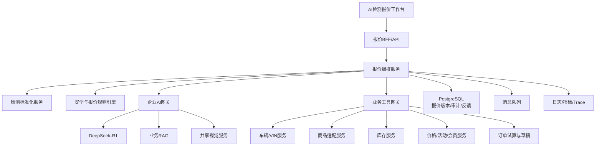
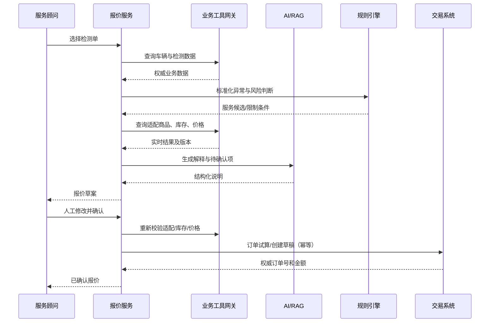

# AI检测报价架构设计（V0.1）

## 1. 架构原则

- 生成式AI与交易权威数据分离。
- 金额计算、车辆适配和安全规则必须确定性执行。
- 存量商品、库存、价格和订单系统继续作为Source of Truth。
- AI不可用不阻断门店人工报价。
- 所有外部调用可追踪、可重试、可幂等、可降级。

## 2. 总体架构



## 3. 职责划分

### 3.1 检测标准化服务

- 适配不同检测设备字段。
- 将故障码、数值、技师文本和视觉结果转换为统一异常项。
- 保留原始值、单位、正常范围、数据来源和置信度。
- 处理重复、冲突和缺失数据。

统一异常对象示例：

```json
{
  "code": "TIRE_TREAD_LOW",
  "component": "front_left_tire",
  "value": 1.5,
  "unit": "mm",
  "severity": "warning",
  "source": "inspection_device",
  "evidence_ids": ["EV001"],
  "confidence": 1.0
}
```

### 3.2 报价编排服务

- 驱动数据校验、规则判断、工具调用和人工节点。
- 保存工作流Checkpoint，支持人工确认后继续。
- 管理超时、重试、补偿和幂等。
- 输出报价草案，不直接写权威订单金额。

可使用状态机或LangGraph编排，但价格和订单工具节点必须是确定性服务。

### 3.3 规则引擎

负责：

- 安全风险等级。
- 车型适配硬约束。
- 服务项目必选、互斥和前置检查。
- 报价审批阈值。
- 价格有效期和刷新策略。
- 过度推荐和近期重复服务拦截。

### 3.4 企业AI网关

- DeepSeek-R1生成异常摘要、报价解释和客户话术。
- RAG提供检测标准、维修知识和服务说明。
- 共享视觉服务解析检测图片和报告。
- 网关统一鉴权、模型路由、Prompt版本、限流和审计。

AI输入只包含必要的脱敏车辆上下文，不包含价格计算权限。

### 3.5 业务工具网关

将Java/遗留业务系统封装为稳定契约：

```text
get_vehicle_profile
get_service_mapping
find_compatible_products
get_store_inventory
get_realtime_price
simulate_order
create_order_draft
get_order_result
```

每个工具定义超时、重试、幂等、缓存和降级策略。

## 4. 报价生成时序



## 5. 数据模型

主要表：

- `inspection_snapshot`：检测输入快照。
- `normalized_issue`：标准化异常项。
- `quote_session`：报价会话和状态。
- `quote_version`：每次生成/修改的报价版本。
- `quote_line`：服务、商品、工时和金额引用。
- `tool_invocation`：工具调用摘要、版本、耗时和状态。
- `review_action`：人工确认、修改和审批。
- `order_binding`：报价与交易订单关系。
- `quote_feedback`：采纳、拒绝、退改和投诉。

价格数据保存交易系统返回快照和版本，不作为后续报价的价格来源。

## 6. API设计

```text
POST /v1/quote-sessions
GET  /v1/quote-sessions/{id}
POST /v1/quote-sessions/{id}/generate
POST /v1/quote-sessions/{id}/issues/{issueId}/confirm
PUT  /v1/quote-sessions/{id}/lines
POST /v1/quote-sessions/{id}/refresh
POST /v1/quote-sessions/{id}/approve
POST /v1/quote-sessions/{id}/submit
POST /v1/quote-sessions/{id}/feedback
```

### 创建订单草稿幂等

- 客户端提供`Idempotency-Key`。
- 服务端保存请求哈希和交易系统结果。
- 超时后先查询原请求结果，不直接重放创建操作。

## 7. 一致性设计

- 页面展示价格必须带`price_version`和`expires_at`。
- 提交前重新执行车辆适配、库存和价格校验。
- 价格变化后生成新报价版本，旧版本只读。
- 订单创建采用本地状态＋交易结果查询，不使用分布式事务强耦合。
- 工具返回的权威金额不可被LLM文本覆盖。

## 8. 缓存与降级

| 数据 | 缓存策略 | 失效时处理 |
|---|---|---|
| 车型基础信息 | 可短期缓存 | 标记版本 |
| 服务知识/RAG | 可缓存 | 回退规则说明 |
| 商品适配 | 极短缓存或不缓存 | 不通过则阻断 |
| 库存 | 不用于承诺的短缓存 | 提交前实时刷新 |
| 价格/优惠 | 不允许用过期缓存确认 | 接口失败则阻断最终报价 |
| AI解释 | 可重新生成 | AI失败时人工编辑 |

## 9. 安全与审计

- VIN、车牌、用户和订单数据最小化传给模型。
- 工具使用服务身份和细粒度权限。
- 大模型无写价格、库存和订单权限。
- 特殊折扣、规则例外和高金额审批使用现有权限体系。
- 保存模型、Prompt、RAG、规则和接口版本。
- 日志不得记录完整Token、用户手机号和支付数据。

## 10. 可观测性

指标包括：

- 端到端报价耗时与各工具P95。
- 检测标准化失败率。
- 车辆适配、库存、价格接口失败率。
- AI解释成功率和人工修改率。
- 价格变化阻断次数、幂等命中和订单创建异常。
- 错价、不适配、漏审和投诉护栏。

统一`trace_id`贯穿检测单、报价会话、工具调用和订单草稿。

## 11. 部署建议

POC采用模块化单体：报价API、标准化、规则和编排同一服务，PostgreSQL保存状态，Redis承担缓存/锁，消息队列处理异步任务。业务工具网关独立部署。

规模化后按流量和责任边界拆分检测标准化、报价编排、规则、工具网关和效果分析服务。

## 12. 测试策略

- 使用脱敏历史检测单做离线回放。
- 建立固定黄金样本，覆盖车型、门店和价格变化。
- 对价格和订单接口进行契约测试。
- 注入库存变化、价格超时、重复提交和AI不可用故障。
- 上线前以影子模式与人工报价对比。
- 所有模型升级必须通过业务护栏回归集。

## 13. 与其他子项目的关系

- 复用智能客服的DeepSeek-R1、RAG和模型网关。
- 复用视觉底座解析检测报告和车辆图片。
- 向AI养护方案提供已确认检测异常，但不直接复用未确认报价建议。
- AI养护方案选择需要立即处理的项目后，可跳转本模块生成实时报价。

