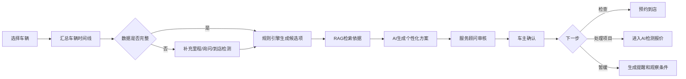

# AI车辆养护方案产品PRD（V0.1）

## 1. 产品概述

AI养护方案模块将车辆档案、里程、历史服务、检测结果和养护知识整合为可解释的分阶段方案。服务顾问可审核和编辑，车主可选择预约检查或将具体项目带入检测报价。

## 2. 产品原则

- 先展示事实和依据，再展示建议。
- “检查建议”与“确定需要更换”严格区分。
- 历史已完成项目必须去重。
- 厂家规则、车辆动力类型和安全规则优先于模型生成。
- 方案不包含权威价格，价格进入检测报价模块实时获取。
- 数据不足时主动询问或建议到店检测。

## 3. 用户故事

### 车主

- 我希望知道现在需要关注什么、为什么以及是否可以延后。
- 我希望系统记住近期已经做过的项目，避免重复推荐。
- 我希望选择建议后再查看准确报价，而不是看到模糊价格。

### 服务顾问

- 我希望快速查看完整车辆时间线和AI建议。
- 我可以调整方案优先级，并说明人工判断原因。
- 我希望一键把客户选中的项目送入检测报价。

### 运营

- 我希望看到方案采纳、重复推荐、投诉和车型覆盖情况。
- 我希望规则和知识可以灰度、回滚和按车型生效。

## 4. 主流程



## 5. 功能需求

### FR-01 车辆选择与授权

- 支持车牌、VIN、订单和用户车辆列表选择。
- 展示数据来源、授权状态和最后更新时间。
- 用户可确认当前里程和主要使用场景。

### FR-02 车辆时间线

- 按时间展示保养、维修、检测、轮胎、电瓶和关键部件记录。
- 合并同一订单的商品和服务项。
- 标记来源：公司订单、检测设备、用户补充、外部记录。
- 对可信度低或冲突记录显示提示。

### FR-03 数据完整性

- 检查VIN、车型、动力类型、里程、车龄和历史服务是否满足规则。
- 对过期里程、缺失车型配置和冲突记录生成待确认项。
- 数据不足时不生成确定性更换结论。

### FR-04 候选建议生成

- 规则引擎根据车型、里程、时间、历史和检测生成候选项。
- 每项标记为安全必检、近期建议、持续观察或信息不足。
- 近期已完成项目进入抑制窗口。
- 高风险项只有检测确认后才能升级为处理建议。

### FR-05 依据展示

- 展示厂家周期、业务知识、检测结果和历史记录依据。
- 引用包含知识名称、版本和适用条件。
- 冲突依据进入人工审核，不由大模型自行裁决。

### FR-06 个性化因素

- 允许选择城市通勤、长途、高速、多尘、低温、高温、长期停放等场景。
- 场景只影响检查频率和解释，不绕过安全规则。
- 显示“哪些个性化信息影响了本次方案”。

### FR-07 方案编辑与审核

- 服务顾问调整优先级、删除项目或新增人工建议。
- 删除/新增/升级高风险项目需要填写原因。
- 保存AI初稿、人工版和最终用户版。

### FR-08 用户方案

- 以“现在、未来1个月、3个月、6个月”展示。
- 每项包含建议、依据、是否需检测、可延后条件和风险提示。
- 避免一次展示过多项目，默认折叠低优先级建议。

### FR-09 行动转化

- 选择“预约检测”进入预约系统。
- 选择具体处理项目进入AI检测报价并重新做车辆适配、库存和价格校验。
- 选择暂缓时可设置里程/日期提醒。
- 跳转时传递方案和证据引用，不传递虚拟价格。

### FR-10 反馈闭环

- 回收查看、采纳、删除、预约、检测、报价、成交和投诉。
- 到店检测结果可验证此前方案。
- 人工修改和用户拒绝进入效果分析，不直接自动训练。

## 6. 页面结构

```text
AI养护方案
├── 车辆选择
├── 车辆健康总览
│   ├── 当前里程/车龄/动力类型
│   ├── 数据完整度
│   └── 最近服务与检测
├── 养护时间线
├── 本次方案
│   ├── 安全必检
│   ├── 近期建议
│   ├── 持续观察
│   └── 信息待补充
├── 依据与引用
├── 顾问审核
├── 用户确认
└── 方案历史与效果
```

## 7. 方案卡片

每个项目展示：

- 项目名称和优先级。
- 推荐动作：检查、保养、观察或处理。
- 推荐原因和引用。
- 最近一次相关服务。
- 是否需要到店检测。
- 可延后条件和提醒时间。
- 进入检测报价按钮。

禁止在此卡片显示由模型猜测的价格。

## 8. 状态机

```text
数据准备中
→ 待补充信息/可生成
→ 方案生成中
→ 待顾问审核
→ 待用户确认
→ 已确认
→ 已预约/已进入报价/已暂缓
→ 已完成/已失效
```

车辆数据、规则或检测结果发生重要变化时，旧方案标记失效并提示重新生成。

## 9. 规则优先级

从高到低：

1. 法规和安全硬规则。
2. 车型/动力类型硬约束。
3. 厂家周期和技术手册。
4. 已确认检测结果。
5. 历史服务与冷却窗口。
6. 公司养护知识。
7. 使用场景个性化。
8. 大模型表达和排序建议。

大模型不得覆盖前六层的确定性结论。

## 10. 异常与降级

| 异常 | 处理 |
|---|---|
| VIN解析失败 | 要求选择准确车型或转人工 |
| 里程过期 | 提示用户确认；未确认只生成低风险检查建议 |
| 历史订单不可用 | 明确记录不完整，阻止强结论和自动提醒 |
| RAG不可用 | 使用规则生成结构化清单，由人工补充解释 |
| DeepSeek-R1不可用 | 展示规则方案，不阻断顾问工作 |
| 检测结果冲突 | 标记冲突并要求技师/顾问确认 |
| 报价系统不可用 | 仍可保存方案，但不能展示或承诺价格 |

## 11. 数据与审计

每个方案版本记录：

- 车辆画像和数据时间快照。
- 使用的历史订单、检测和用户补充。
- 规则、知识、Prompt和模型版本。
- AI初稿、人工修改和理由。
- 用户确认和下一步动作。
- 后续检测、报价、订单和投诉结果。

## 12. 权限和隐私

- 用户授权后才允许跨订单汇总车辆历史。
- 服务顾问只能访问其业务权限范围内车辆。
- 运营看板使用聚合/脱敏数据。
- 模型训练候选数据需再次进行授权和脱敏判断。
- 方案分享链接使用短期Token并可撤销。

## 13. 指标与埋点

- 方案生成成功率和耗时。
- 数据完整率、里程确认率、信息补充率。
- 人工审核通过率和修改项数。
- 重复推荐、冲突建议和无依据建议数。
- 用户查看、采纳、预约、报价和暂缓。
- 投诉、退改和过度推荐反馈。
- 不同车型、车龄、门店和规则版本效果。

## 14. MVP验收用例

1. 近期已更换机油的车辆不会再次生成立即更换建议。
2. 里程已超过时效时，系统要求确认后才生成周期方案。
3. 新能源车不会套用燃油车机油保养规则。
4. 无检测证据时，高风险部件只建议检查，不直接建议更换。
5. 顾问删除建议后，系统保存原因和前后版本。
6. 用户选择项目进入检测报价后，重新查询适配、库存和价格。
7. R1不可用时仍展示结构化规则方案。

## 15. MVP范围

纳入：燃油车白名单车型、车辆时间线、常规保养/轮胎/电瓶、历史去重、规则＋RAG＋R1、人工审核、预约/报价跳转、审计反馈。

不纳入：全车型覆盖、自动触达营销、无人审核高风险建议、自动下单和完全替代专业检测。

