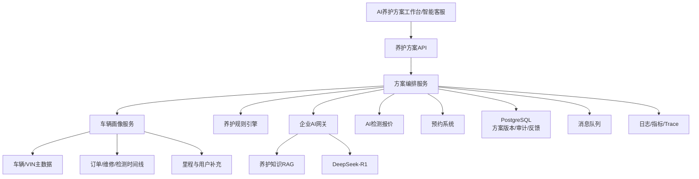
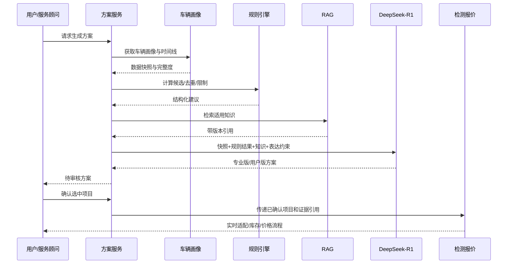

# AI车辆养护方案架构设计（V0.1）

## 1. 架构原则

- 规则生成事实性候选，大模型负责解释和表达。
- 车辆时间线是方案的统一事实入口。
- 厂家知识、动力类型、安全规则和检测事实优先。
- 方案与报价解耦，价格在检测报价模块实时获取。
- 数据缺失时降级为询问或检查建议。
- AI不可用不阻断服务顾问使用结构化方案。

## 2. 总体架构



## 3. 车辆画像与时间线

### 3.1 数据来源

- VIN和车型主数据。
- 用户车辆档案。
- 门店订单和服务明细。
- 检测设备和已确认异常。
- 轮胎、电瓶等专项记录。
- 用户确认的里程和使用场景。

### 3.2 标准事件模型

```json
{
  "event_id": "VE001",
  "vehicle_id": "V001",
  "event_type": "service_completed",
  "occurred_at": "2026-06-01T10:00:00+08:00",
  "mileage_km": 42000,
  "items": ["ENGINE_OIL", "OIL_FILTER"],
  "source": "order_system",
  "source_id": "O001",
  "confidence": 1.0
}
```

所有原始来源转换为不可变时间线事件，方案生成时创建数据快照，避免历史数据变化后无法解释旧方案。

### 3.3 数据可信度

建议来源优先级：权威订单/检测设备 > 门店人工确认 > 用户补充 > 模型推断。模型推断不得成为“已完成服务”事实。

## 4. 规则引擎

### 4.1 规则类型

- 时间周期：距上次服务的月份。
- 里程周期：距上次服务的公里数。
- 时间/里程任一先到。
- 车型和动力类型限制。
- 检测值阈值。
- 历史去重和冷却窗口。
- 服务互斥、依赖和组合。
- 季节、地区和使用场景修正。
- 安全风险和人工确认要求。

### 4.2 规则结果

规则输出结构化候选，不输出自然语言长文：

```json
{
  "item_code": "TIRE_INSPECTION",
  "action": "inspect",
  "priority": "near_term",
  "reason_codes": ["MILEAGE_THRESHOLD", "LAST_INSPECTION_EXPIRED"],
  "required_evidence": [],
  "blocked_actions": ["direct_replacement"],
  "next_due": {"within_days": 30}
}
```

## 5. RAG与DeepSeek-R1

### 5.1 RAG知识域

- 厂家保养周期和手册。
- 公司养护知识和服务SOP。
- 轮胎、电瓶和常规保养规范。
- 新能源/燃油车差异。
- 客户解释和风险提示模板。

知识条目必须有车型/动力类型、适用年份、生效时间、版本和来源。

### 5.2 R1职责

- 汇总车辆状态。
- 将规则结果和引用组织为专业版/用户版方案。
- 生成补充问题。
- 解释为什么建议检查、处理或观察。

R1不得：

- 创造未出现的检测事实。
- 将“周期已到”表述为“部件已经损坏”。
- 绕过车型和安全规则。
- 生成权威价格。

## 6. 方案生成时序



## 7. 数据模型

主要表：

- `vehicle_profile_snapshot`：车辆画像快照。
- `vehicle_timeline_event`：标准车辆事件。
- `maintenance_rule`和`maintenance_rule_version`：规则及版本。
- `maintenance_plan`：方案主记录和状态。
- `maintenance_plan_version`：AI/人工版本。
- `maintenance_recommendation`：建议项、优先级和依据。
- `knowledge_citation`：RAG引用。
- `plan_review_action`：人工修改和审批。
- `plan_user_action`：查看、采纳、暂缓、预约和报价。
- `plan_outcome`：后续检测、订单、投诉和结果。

## 8. API设计

```text
GET  /v1/vehicles/{id}/timeline
GET  /v1/vehicles/{id}/profile-completeness
POST /v1/maintenance-plans
GET  /v1/maintenance-plans/{id}
POST /v1/maintenance-plans/{id}/generate
PUT  /v1/maintenance-plans/{id}/recommendations
POST /v1/maintenance-plans/{id}/review
POST /v1/maintenance-plans/{id}/confirm
POST /v1/maintenance-plans/{id}/book
POST /v1/maintenance-plans/{id}/quote
POST /v1/maintenance-plans/{id}/feedback
```

## 9. 版本与失效

- 方案保存车辆快照、规则、知识、Prompt和模型版本。
- 当前里程、检测结果或关键订单变化时计算影响范围。
- 受影响方案标记`stale`，不直接删除。
- 用户再次查看时提示重新生成。
- 规则和知识支持灰度与回滚，历史方案仍指向旧版本。

## 10. 与AI检测报价的边界

| 能力 | 养护方案 | 检测报价 |
|---|---|---|
| 目标 | 说明何时关注/检查/养护 | 形成当前可交易报价草案 |
| 核心输入 | 车辆时间线和周期 | 当前检测异常和实时交易数据 |
| 价格 | 不生成权威价格 | 实时查询并由交易系统试算 |
| 库存 | 不需要 | 必须实时查询 |
| 风险结论 | 多为检查/观察 | 已确认异常可进入服务项目 |
| 输出 | 阶段性计划 | 商品/服务/工时/金额明细 |

从养护方案进入报价时，只传递用户/顾问已选择的项目和依据，报价模块必须重新进行检测、适配、库存和价格校验。

## 11. 缓存与降级

- 车辆基础信息可短期缓存，但必须显示快照时间。
- 历史时间线按事件增量更新。
- 规则计算可本地执行，不依赖大模型。
- RAG不可用时返回规则结果和“解释暂不可用”。
- R1不可用时展示结构化方案。
- 报价不可用时允许保存选择，稍后重试，不显示估算价格。

## 12. 安全与隐私

- 车辆、VIN、车牌和用户关系按最小权限访问。
- 模型输入使用内部车辆ID，非必要不传车牌和用户身份。
- 用户授权决定是否可跨订单汇总历史。
- 数据导出、分享、人工查看和训练入池均记录审计。
- 用户可查看数据来源并申请更正或删除允许删除的数据。

## 13. 可观测性

- 车辆画像完整度和数据新鲜度。
- 时间线构建错误率和重复事件数。
- 规则命中、冲突和被人工覆盖次数。
- RAG召回质量、知识版本和无引用建议数。
- R1生成延迟、失败率和人工修改率。
- 方案到预约/报价/订单漏斗。
- 重复推荐、过度推荐、安全错误和投诉。

## 14. 部署建议

POC阶段采用模块化单体：车辆画像适配、规则、编排和方案API部署在同一Python/Java服务中；PostgreSQL保存权威方案状态，Redis用于缓存和锁，消息队列处理异步生成和结果回流。

现有AI网关统一调用DeepSeek-R1和RAG，不在本项目重复部署大模型。规模化后按车辆画像、规则、方案编排和效果分析拆分。

## 15. 测试策略

- 建立按车型、车龄、里程和历史服务分层的黄金集。
- 历史订单与当前里程使用时间穿越测试，验证当时方案。
- 覆盖新能源误路由、近期已服务、历史缺失和规则冲突。
- RAG引用进行来源、适用车型和生效时间校验。
- 注入R1、RAG、车辆、订单和报价系统故障验证降级。
- 上线前影子评审，不直接对用户发送。

## 16. 与公共底座的复用

- 复用智能客服的DeepSeek-R1、RAG、鉴权和审计。
- 复用共享视觉底座处理车主上传的检测报告和车辆照片。
- 复用AI检测报价的车辆适配、商品和交易工具，但不在方案阶段调用实时价格。
- 复用AI运营工作台的角色、通知、任务和运营看板框架。

