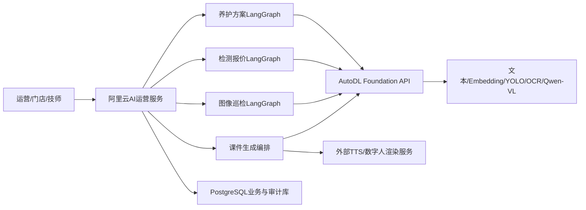

# AI运营统一基座接入与业务编排架构（V1.0）

## 1. 部署边界

AI运营应用部署在当前阿里云服务器，负责页面、业务API、LangGraph、业务规则、PostgreSQL持久化和调用审计。模型推理统一调用AutoDL大模型通用基座，AI运营不直接访问Ollama、YOLO、OCR或Qwen-VL内部端口。



## 2. 四个业务模块

| 模块 | 通用基座调用 | AI运营自身负责 |
|---|---|---|
| 数字人培训课件 | `/text/chat`、`/embeddings`，后续课件图片调用OCR/VL | 课件RAG命名空间、脚本/字幕编排、HTML课件、审核、数字人渲染任务 |
| AI图像质检 | `/vision/analyze` | 巡检LangGraph、场景阈值、合规规则、人工复核、整改闭环 |
| AI检测报价 | `/vision/analyze`、`/embeddings`、`/text/chat` | 报价LangGraph、商品/库存/工时工具、价格校验、人工确认 |
| AI养护方案 | `/embeddings`、`/text/chat` | 养护LangGraph、车辆/里程工具、保养规则、项目分级和合规校验 |

## 3. 代码实现

- `lib/foundation.ts`：统一鉴权、超时、响应信封、trace和模型版本适配。
- `lib/workflows.ts`：三个业务LangGraph工作流。
- `lib/business.ts`：稳定业务Schema。
- `business_runs`：保存输入、结果、模式、trace和模型版本。
- `/api/inspection/analyze`：视觉巡检入口。
- `/api/quotes/generate`：检测报价入口。
- `/api/maintenance/generate`：养护方案入口。
- `/api/runs`：运行历史查询入口。

## 4. 工作流

### 4.1 图像巡检

```text
image_id → Foundation视觉分析 → 合规规则校验 → 人工复核分流 → 保存运行记录
```

### 4.2 检测报价

```text
车辆/检测结果/image_id → 视觉分析 → 维修知识检索 → 文本推理 → 价格与合规校验 → 保存
```

### 4.3 养护方案

```text
车型/里程/车况 → 养护知识检索 → 文本方案生成 → 必须/建议/观察分级 → 保存
```

## 5. 配置

```env
FOUNDATION_API_URL=http://autodl-foundation-host:port
FOUNDATION_API_KEY=由通用基座分配的ai-ops独立密钥
FOUNDATION_APP_ID=ai-ops
FOUNDATION_TIMEOUT_MS=90000
DIGITAL_HUMAN_API_URL=
DIGITAL_HUMAN_API_KEY=
```

`FOUNDATION_API_URL`填写通用基座网关地址，不填写具体能力路径；客户端自行拼接`/foundation/v1/...`。未配置时进入Mock模式，便于独立部署与验收页面、数据库和编排。

## 6. 上线前联调清单

1. AutoDL基座为`ai-ops`签发独立API Key并限制来源IP。
2. 核对`/foundation/v1/health`、`models`和`capabilities`。
3. 确认视觉上传后获得的`image_id`能被AI运营服务引用。
4. 为四个业务建立独立RAG集合或严格隔离的命名空间。
5. 将商品价格、库存和工时接入确定性工具，不让文本模型自行编造价格。
6. 高风险视觉结论、维修报价和安全建议必须经过人工确认。
7. 生产环境关闭Mock结果或在页面显著标记Mock模式。
